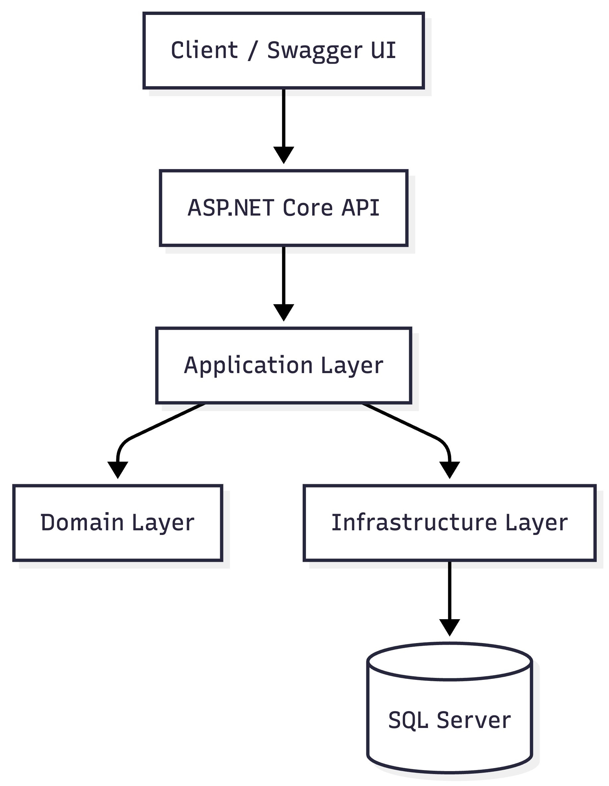

# Architecture

The Banking API Simulator follows a layered architecture to separate concerns and improve maintainability.

## High-Level Architecture

## Layers

### API Layer

Responsibilities:
- Expose REST endpoints
- Authentication & Authorization
- Request validation
- Swagger documentation

### Application Layer

Responsibilities:
- Business rules
- Use cases
- Transfer processing
- Account operations

### Domain Layer

Responsibilities:
- Core business entities
- Domain logic
- Banking rules

Entities:
- Customer
- Account
- Transaction
- AuditLog

### Infrastructure Layer

Responsibilities:
- EF Core
- SQL Server
- Repository implementations
- Persistence

## Benefits

- Separation of concerns
- Easier testing
- Better maintainability
- Scalable design